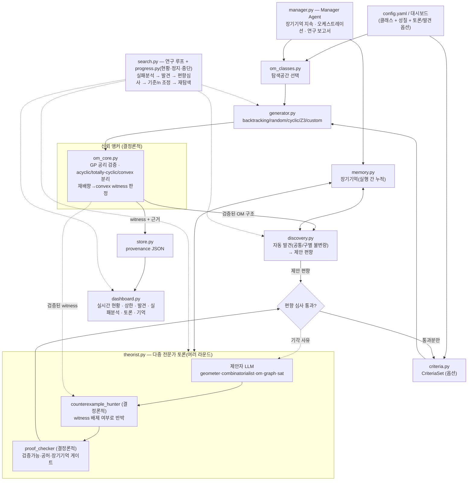

# McMullen-OM Lab

McMullen 문제를 **유향 매트로이드(OM)** 로 재구성해, "어떤 사영변환(=재배향)으로도
볼록 위치(convex position)로 만들 수 없는" uniform OM 을 **가능한 한 적은 원소 수 n** 으로
찾는 로컬 연구 에이전트입니다. 그런 OM 을 n 개 원소에서 찾으면 OM-McMullen 상한이 **n−1** 로 내려갑니다.

## 빠른 시작 (Clone 후 3단계)

```bash
git clone <이 저장소 URL>
cd mcmullen_lab
# Windows PowerShell:  .\scripts\setup.ps1     |   macOS/Linux:  bash scripts/setup.sh
python run.py --config config.example.yaml
```

자세한 절차(가상환경, 옵션 의존성, Claude Code 연동)는 §3, §4, 그리고 `CLAUDE.md` 를 참고하세요.

---

## 0. 신뢰 모델 (가장 중요)

이 시스템의 신뢰 앵커는 **`om_core.py` 의 결정론적 검증기** 하나뿐입니다.

* 생성기/LLM 이 무엇을 내놓든, "상한을 개선했다"고 기록되려면 **반드시** `om_core` 의
  공리 검증과 재배향-convex 판정을 통과해야 합니다.
* 로컬 LLM 위원회가 내놓는 것은 전부 **미검증 가설**입니다. 탐색 방향을 실제로 바꾸는
  '편향'으로 승격되려면, 기계적으로 검증 가능한 형식이고 작은 인스턴스에서 모순/공허하지
  않음이 결정론적으로 확인돼야 합니다(자유 서술형 추측은 기록만 되고 자동 적용되지 않음).

즉 LLM 은 **브레인스토밍/방향 제안**만 하고, 진위는 코드가 가립니다. 8B급 로컬 모델이
그럴듯하지만 틀린 OM "정리"를 내놓아도 탐색이 오염되지 않습니다.

---

## 1. 수학적 재구성 (요약)

* R^d 일반위치 n점 ↔ 동차화로 **rank r=d+1 uniform acyclic OM**. 사영변환 ↔ **재배향**(부호반전).
* **키로토프** χ: r-부분집합에 부여한 교대 부호. uniform 에서는 **3-term Grassmann–Plücker**
  관계가 적법성의 **필요충분** 조건 → 금지 패턴 `(s1,s2,s3)∈{(+,−,+),(−,+,−)}` 만 막으면 됨.
* **circuit = Radon 분할**(r+1 부분집합), **cocircuit**(r−1 부분집합).
* 세 상태를 **엄격히 분리**:
  * `acyclic` : 양의 회로 없음
  * `totally cyclic` : 양의 **코**회로 없음 = acyclic 의 **쌍대**(원점 내부) — convex 와 **무관**
  * `convex independent` : 모든 Radon 분할이 **균형**(양쪽 ≥ 2) — Carathéodory 로 정당화
* **McMullen(OM) 목표**: 재배향으로도 convex 가 안 되는 uniform OM(실현 가능/불가능 무관)을
  최소 n 으로. n 에서 찾으면 상한 ≤ n−1. d=5 의 구체 목표는 **rank-6, n=12** witness →
  ν(5) ≤ 11 (Larman f(5)=11).
* **보상** `reward = (U+1) − n`,  느슨한 상한 `U = 2d + ⌊(1+d)/2⌋` (d=2→5, d=3→8, d=5→13).

---

## 2. 파일 구성 ↔ 당신의 4가지 요구

| 요구 | 구현 |
|---|---|
| **① 간단한 조작으로 로컬 루프 실행** | `run.py`(CLI) + `config.yaml`,  또는 `dashboard.py`(버튼) |
| **① 클래스(탐색 공간) 지정** | `om_classes.py` 레지스트리 + `config` 의 `om_class` + 대시보드 선택 + `--list-classes` |
| **② 이론적 성질을 쉽게 넣고 빼는 옵션** | `criteria.py` 레지스트리 + `config.yaml` 의 `criteria` 목록 + 대시보드 토글 |
| **② 실시간 현황 + 일시정지/중단** | `progress.py`(Progress·Control·SearchRunner) + 대시보드 라이브 패널 + CLI 한 줄 현황(Ctrl-C 중단) |
| **③ 어떤 구성이 어떤 상한 개선/성질을 썼는지 도출** | `store.py` provenance(JSON): witness 마다 `implied_upper_bound`, `criteria_satisfied/failed`, 승격된 편향 |
| **④ 결과를 알아보기 쉬운 UI** | `dashboard.py`(Streamlit): 실시간 현황 + 핵심 상한·성질 분포·결과표·witness 근거 상세 |

핵심 모듈: `om_core.py`(검증 앵커) · `om_classes.py`(탐색 공간) · `generator.py`(후보 생성) · `criteria.py`(옵션) · `discovery.py`(자동 발견) · `theorist.py`(다중 전문가 토론+결정론적 반례/증명검사) · `memory.py`(장기기억) · `search.py`(연구 루프) · `manager.py`(오케스트레이터) · `progress.py`(현황/제어).

### 리뷰 반영: "탐색기 → 연구 에이전트"

다른 AI 의 평가(다중 에이전트 협업·장기기억·자동 발견·학습 루프 부재)를 반영했습니다.
**요청대로 '다분야 전문가 토론' 구조이며, 단일 통합모델이 전부를 처리하지 않습니다.**

| 지적 | 반영 |
|---|---|
| ① LLM 이 수동적/단발 | `theorist.run_debate` — **여러 라운드**로 제안→반박→수정. 기각 사유가 다음 라운드로 전달 |
| ② theorist 하나뿐 | **역할 분리**: geometer·combinatorialist·om_expert·graph_expert·sat_expert (제안자) + **결정론적 적대자** 2종 |
| ③ search 가 단순 | **학습 루프**: 실패 사유 집계 → 발견 → 편향 심사 → 기준/ n 조정 → 재탐색 |
| ④ 장기기억 없음 | `memory.py` — 제너레이터/기준/편향/조합 통계가 `memory.json` 에 **실행 간 누적** ("이 편향 N회 실패") |
| ⑤ 발견 시스템 없음 | `discovery.py` — witness 구조를 **자동 분석**(공통/구별 불변량), 제안 편향 도출 |
| Manager 부재 | `manager.py` — Memory·Search·Discovery·Theory 를 묶고 **연구 보고서** 생성 |

**핵심 설계 판단(정직성)**: 토론의 적대자인 **Counterexample Hunter 와 Proof Checker 는 LLM 이 아니라 결정론적 코드**입니다. Hunter 는 제안된 편향이 *이미 검증된 witness* 를 배제하게 되는지 실제로 확인해 반박하고, Checker 는 기계적 검증 가능성·공허성·장기기억(반복 실패)을 겁니다. 그래서 토론이 '말싸움'이 아니라 실제 데이터에 근거한 반증을 갖습니다. LLM 은 방향만 제안하고, 채택은 코드가 정합니다.

---

## 3. 로컬 설치 (단계별)

### GitHub 에서 처음 받는 경우

```bash
git clone <저장소 URL>
cd mcmullen_lab
```

Windows 는 `scripts\setup.ps1`, macOS/Linux 는 `scripts/setup.sh` 를 실행하면 가상환경 생성
→ 설치 → 자체 테스트까지 한 번에 됩니다(§0 빠른 시작 참고). 아래는 그 스크립트가 하는 일을
그대로 풀어 쓴 것이니, 손으로 하나씩 하고 싶다면 이걸 따라가세요.

```bash
# (1) 폴더로 이동
cd mcmullen_lab

# (2) 가상환경 (선택이지만 강력 권장)
python3 -m venv .venv
source .venv/bin/activate            # Windows: .venv\Scripts\Activate.ps1

# (3) 패키지 설치 — pyproject.toml 기반. 코어만 필요하면 대괄호 생략 가능.
pip install -e ".[all]"              # UI(streamlit/pandas) + config(yaml) + z3 + llm(requests) 전부
# 필요한 것만: pip install -e ".[ui]"  또는  pip install -e ".[ui,config]"  등

# (4) 코어가 도는지 자체 점검
python om_core.py                    # 검증 코어 자기검사
python search.py                     # d=2 데모 루프 (witness 발견 확인)
```

> `requirements.txt` 도 그대로 남아있어(`pip install -r requirements.txt`), pyproject 기반
> 설치를 원치 않으면 이전처럼 써도 됩니다. 두 방식은 같은 의존성을 가리킵니다.

### Claude Code 로 관리하기

이 저장소에는 `CLAUDE.md`(Claude Code 가 자동으로 읽는 프로젝트 지침 — 신뢰 모델, 아키텍처
지도, 테스트 명령)가 포함돼 있습니다. 저장소 폴더에서 `claude` 를 실행하면 별도 설명 없이도
이 프로젝트의 불변 조건(검증기 우선, 결정론적 적대자 등)을 지키며 작업합니다. 최초 GitHub
이전은 `CLAUDE_CODE_BOOTSTRAP_PROMPT.md` 의 프롬프트를 그대로 붙여넣으면 됩니다.

### (선택) 로컬 LLM 위원회 — Ollama

```bash
# Ollama 설치 후
ollama serve                         # 백그라운드 데몬
ollama pull qwen2.5                  # 또는 llama3.1 등
# 다중 전문가 토론 켜고 실행:
python run.py --config config.example.yaml --research --llm --model qwen2.5 --debate-rounds 3
```

---

## 4. 실행 방법

### CLI (대규모/배치에 적합)
```bash
python run.py --config config.example.yaml                 # 설정대로
python run.py --config config.example.yaml --d 3 --n-min 8 --n-max 8 --rounds 1
python run.py --config config.example.yaml --backend random --d 3 --n-min 8   # 실현가능 witness 빠르게
python run.py --config config.example.yaml --backend z3 --no-dedup   # 대규모
# 연구 에이전트 모드(장기기억 + 발견 + 토론 + 보고서):
python run.py --config config.example.yaml --research --memory memory.json --class realizable_uniform --d 3 --n-min 8
python run.py --config config.example.yaml --research --llm --model qwen2.5 --debate-rounds 3
# 결과: results.json
```

### 대시보드 (탐색 기준 토글 + 결과 보기)
```bash
streamlit run dashboard.py
```
왼쪽에서 d/n 범위와 **성질 토글**(require/forbid/target)을 정하고 **탐색 실행**.
또는 사이드바에 기존 `results.json` 경로를 넣어 과거 결과만 볼 수도 있습니다.

---

## 5. 클래스(탐색 공간) 지정 (요구 ①)

루프를 어떤 OM 집합 위에서 돌릴지 `om_class` 로 고릅니다.

```bash
python run.py --list-classes      # 사용 가능한 클래스 보기
```
| 클래스 | 의미 |
|---|---|
| `uniform` | 모든 uniform OM (rank d+1, 전수 백트래킹; 비실현 포함) |
| `realizable_uniform` | 실현가능 uniform OM (무작위 점배치, d≥3 에서 빠름) |
| `rank2_uniform` | rank-2 uniform OM (rank=2 고정) — **REOM 실험 기반** |
| `cyclic` | 순환다면체(교대) OM — 기준선/시드 |
| `lawrence` | 소켓 — REOM 인코딩 연결 시 동작 |

`config.yaml` 의 `om_class:` 또는 `--class` 로 지정. **새 클래스(당신의 REOM)** 추가:
```python
from om_classes import OMClass, register_class
register_class(OMClass("reom", "rank-2 Lawrence(REOM)", backend="custom", rank=2),
               generator=my_reom_generator)   # (n, r, *, accept, **kw) -> Iterator[Chirotope]
```

> ⚠ **rank-2 주의(솔직)**: 일반 OM 정의에서 convex position 은 "모든 Radon 분할이 양쪽 ≥2"
> 인데, rank 2 의 회로는 원소 3개라 항상 (1,2) 분할 → **rank-2 OM 은 이 정의상 전부
> non-convex** 입니다. 즉 literal McMullen(d=1) 으로는 모든 rank-2 OM 이 자명히 witness 가
> 되어 의미가 없습니다. `rank2_uniform` 은 **당신의 REOM 인코딩이 상한을 재해석하는
> 기반(substrate)** 으로 쓰라고 둔 것이며, literal d=1 탐색용이 아닙니다.

## 6. 실시간 현황 · 일시정지 · 중단 (요구 ②)

한 번의 루프가 길어질 수 있으므로, 실행 중 현황이 계속 갱신됩니다.
* **CLI**: 한 줄 현황(상태·round/n·후보수·witness·**현재 최소 상한**·**현재 최선 구성**·경과).
  `Ctrl-C` 로 안전 중단 → 그때까지 결과가 저장됩니다.
* **대시보드**: 실시간 패널 + **일시정지 / 재개 / 중단** 버튼. 탐색은 백그라운드 스레드에서
  돌고 화면은 자동 갱신됩니다. 중단해도 부분 결과가 그대로 표에 남습니다.

탐색 공간을 따로 두지 않고 코드로 직접 제어하려면:
```python
from search import SearchConfig
from progress import SearchRunner
runner = SearchRunner(SearchConfig(d=3, om_class="realizable_uniform"), "out.json")
runner.start();  runner.pause();  runner.resume();  runner.stop()
snap = runner.snapshot()   # snap.best_config, snap.best_upper_bound, snap.candidates ...
```

## 7. 탐색 기준 넣고 빼기 (요구 ②)

`config.yaml` 의 `criteria` 한 줄씩:
```yaml
criteria:
  - {name: acyclic, mode: require}
  - {name: totally_cyclic, mode: forbid}
  - {name: not_reorientable_to_convex, mode: target}
  - {name: circuit_balance_at_least, mode: forbid, args: [2]}   # 예: convex 직전 구조 회피
```
`mode` = `require`(만족해야 채택) / `forbid`(만족하면 탈락) / `target`(달성하면 witness).

**새 성질을 코드로 추가**하려면 `criteria.py` 에 한 줄:
```python
register("my_prop", lambda ch: <om_core 판별로 만든 bool>, "내 성질 설명")
```
이후 config/대시보드에서 바로 `my_prop` 으로 쓸 수 있습니다.

---

## 8. 결과 읽기 (요구 ③)

`results.json` 의 각 witness 레코드:
```json
{
  "id": "...", "n": 12, "r": 6, "d": 5,
  "is_witness": true,
  "implied_upper_bound": 11, "target_bound": 11, "solves_conjecture": true,
  "reward": 2.0,
  "criteria_satisfied": ["valid","acyclic","not_reorientable_to_convex"],
  "criteria_failed": ["totally_cyclic"],
  "promoted_biases": [ ... ],          // 이 시점에 검증 통과해 적용된 LLM 편향
  "chirotope": { "n":12, "r":6, "signs": { ... } }
}
```
→ **어떤 구성(`chirotope`)이, 어떤 상한 개선(`implied_upper_bound`)을, 어떤 이론적 성질
(`criteria_satisfied`)로 달성했는지**가 한 건마다 명확합니다. 대시보드가 이를 그대로 시각화합니다.

---

## 9. 아키텍처 (Discovery Loop)



핵심: **검증기가 중앙**, LLM 은 방향만 제안. 토론의 **반례 사냥·증명 검사는 결정론적 코드**라 실제 데이터로 반박한다. 발견·기억도 검증된 데이터에 대한 결정론적 산출물이다.

---

## 10. 솔직한 확장성(트랙터빌리티) 안내

* **개별 후보 검증은 d=5, n=12 에서도 빠릅니다.** (재배향 2¹¹×convex검사 ≈ 백만 단위/후보)
  → **당신이 구조적 후보를 직접 공급하면**(예: Lawrence/REOM 구성) 코어가 즉시 판정합니다.
* **모든 uniform OM 의 전수 생성은 d=5, n~12 에서 비현실적**입니다(이중지수 증가).
  백트래킹은 작은 n 데모용입니다. 세 백엔드의 역할:
  * `backtracking` — 작은 n 전수(비실현 포함). lexicographic 순서라 d>=3 에선 convex 영역을 먼저 훑음.
  * `random` — R^d 무작위 점배치 → **실현가능** witness 를 빠르게 발견(d=3 에서 n=8 witness 즉시).
  * `z3` — GP+편향을 SMT 로 인코딩, 대규모/구조적 탐색.
  현실적 경로:
  1. **구조적 시드**(순환다면체·Lawrence·당신의 rank-2 REOM)에서 출발,
  2. **대칭 축소** + **타깃 SAT/Z3**(`backend: z3`)로 GP+편향을 인코딩,
  3. 위원회는 '어떤 부분구조를 고정/금지할지' 같은 **검증 가능한 편향**만 제안.
* d=2 는 이미 tight(U=2d+1)이므로 reward 0 이지만, d=3/d=5 에서는 n=2d+2 witness 가
  양의 reward 와 `solves_conjecture=true` 를 줍니다.

### 당신의 REOM(rank-2 Lawrence) 연결
당신의 signed-permutation-tuple / ABA-패턴 인코딩을 `generator.py` 의 백엔드로 꽂으면,
rank-6 문제를 rank-2 로 축약한 **타깃 생성기**가 됩니다. 그 인코딩(또는 Z3 제약)을 알려주시면
`generate_reom(...)` 백엔드로 통합해 드립니다 — 코어 검증은 그대로 재사용됩니다.
