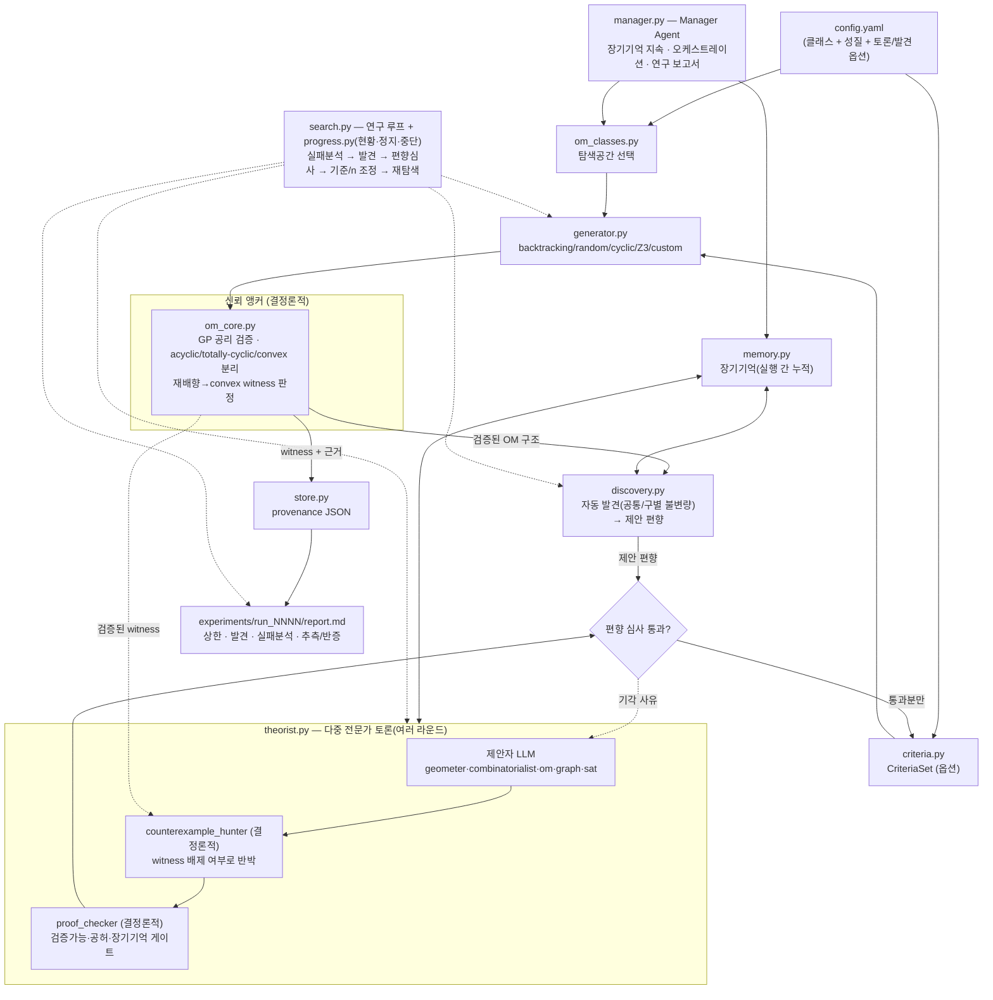

# McMullen-OM Lab

McMullen 문제를 **유향 매트로이드(OM)** 로 재구성해, "어떤 사영변환(=재배향)으로도
볼록 위치(convex position)로 만들 수 없는" uniform OM 을 **가능한 한 적은 원소 수 n** 으로
찾는 로컬 연구 에이전트입니다. 그런 OM 을 n 개 원소에서 찾으면 OM-McMullen 상한이 **n−1** 로 내려갑니다.

> **새 워크플로 (0028): 정리 발굴 루프.** 기존 탐색기는 witness 를 찾고 검증하지만,
> 거기서 **수학적 성질을 문장으로 뽑아내지는 못했습니다.** 이제 그 계층이 생겼습니다 —
> §11 을 보세요. 한 줄 요약:
> `python research_cycle.py run --d 2 --n 6` → 생성된 프롬프트를 고급 모델 대화창에
> 붙여넣기 → 답을 저장 → `python research_cycle.py ingest --run 0001`.
> **API 키는 필요 없습니다.**

## 빠른 시작 (Clone 후 3단계)

```bash
git clone <이 저장소 URL>
cd mcmullen_lab
# Windows PowerShell:  .\scripts\setup.ps1     |   macOS/Linux:  bash scripts/setup.sh
python run.py --config config.example.yaml
```

자세한 절차(가상환경, 옵션 의존성, Claude Code 연동)는 §3, §4, 그리고 `CLAUDE.md` 를 참고하세요.

---

## 0. 신뢰 모델 (가장 중요)

이 시스템의 신뢰 앵커는 **`om_core.py` 의 결정론적 검증기** 하나뿐입니다.

* 생성기/LLM 이 무엇을 내놓든, "상한을 개선했다"고 기록되려면 **반드시** `om_core` 의
  공리 검증과 재배향-convex 판정을 통과해야 합니다.
* 로컬 LLM 위원회가 내놓는 것은 전부 **미검증 가설**입니다. 탐색 방향을 실제로 바꾸는
  '편향'으로 승격되려면, 기계적으로 검증 가능한 형식이고 작은 인스턴스에서 모순/공허하지
  않음이 결정론적으로 확인돼야 합니다(자유 서술형 추측은 기록만 되고 자동 적용되지 않음).

즉 LLM 은 **브레인스토밍/방향 제안**만 하고, 진위는 코드가 가립니다. 8B급 로컬 모델이
그럴듯하지만 틀린 OM "정리"를 내놓아도 탐색이 오염되지 않습니다.

---

## 1. 수학적 재구성 (요약)

* R^d 일반위치 n점 ↔ 동차화로 **rank r=d+1 uniform acyclic OM**. 사영변환 ↔ **재배향**(부호반전).
* **키로토프** χ: r-부분집합에 부여한 교대 부호. uniform 에서는 **3-term Grassmann–Plücker**
  관계가 적법성의 **필요충분** 조건 → 금지 패턴 `(s1,s2,s3)∈{(+,−,+),(−,+,−)}` 만 막으면 됨.
* **circuit = Radon 분할**(r+1 부분집합), **cocircuit**(r−1 부분집합).
* 세 상태를 **엄격히 분리**:
  * `acyclic` : 양의 회로 없음
  * `totally cyclic` : 양의 **코**회로 없음 = acyclic 의 **쌍대**(원점 내부) — convex 와 **무관**
  * `convex independent` : 모든 Radon 분할이 **균형**(양쪽 ≥ 2) — Carathéodory 로 정당화
* **McMullen(OM) 목표**: 재배향으로도 convex 가 안 되는 uniform OM(실현 가능/불가능 무관)을
  최소 n 으로. n 에서 찾으면 상한 ≤ n−1. d=5 의 구체 목표는 **rank-6, n=12** witness →
  ν(5) ≤ 11 (Larman f(5)=11).
* **보상** `reward = (U+1) − n`,  느슨한 상한 `U = 2d + ⌊(1+d)/2⌋` (d=2→5, d=3→8, d=5→13).

---

## 2. 파일 구성 ↔ 당신의 4가지 요구

| 요구 | 구현 |
|---|---|
| **① 간단한 조작으로 로컬 루프 실행** | `run.py`(CLI) + `config.yaml`, `research_cycle.py`(연구 루프 CLI) |
| **① 클래스(탐색 공간) 지정** | `om_classes.py` 레지스트리 + `config` 의 `om_class` + `--list-classes` |
| **② 이론적 성질을 쉽게 넣고 빼는 옵션** | `criteria.py` 레지스트리 + `config.yaml` 의 `criteria` 목록, 그리고 `invariants.py` 어휘(LLM 확장 가능) |
| **② 실시간 현황 + 일시정지/중단** | `progress.py`(Progress·Control·SearchRunner) + CLI 한 줄 현황(Ctrl-C 중단) |
| **③ 어떤 구성이 어떤 상한 개선/성질을 썼는지 도출** | `store.py` provenance(JSON): witness 마다 `implied_upper_bound`, `criteria_satisfied/failed`, 승격된 편향 |
| **④ 결과를 알아보기 쉬운 형태** | `experiments/run_NNNN/report.md` (사람이 읽는 라운드 보고서) + `research_log.md` (한 줄 이력). 0029 에서 Streamlit 대시보드를 제거하고 대화창에서 CLI 로 운용하는 방식으로 전환했다 |

핵심 모듈: `om_core.py`(검증 앵커) · `om_classes.py`(탐색 공간) · `generator.py`(후보 생성) · `criteria.py`(옵션) · `discovery.py`(자동 발견) · `theorist.py`(다중 전문가 토론+결정론적 반례/증명검사) · `memory.py`(장기기억) · `search.py`(연구 루프) · `manager.py`(오케스트레이터) · `progress.py`(현황/제어).

### 리뷰 반영: "탐색기 → 연구 에이전트"

다른 AI 의 평가(다중 에이전트 협업·장기기억·자동 발견·학습 루프 부재)를 반영했습니다.
**요청대로 '다분야 전문가 토론' 구조이며, 단일 통합모델이 전부를 처리하지 않습니다.**

| 지적 | 반영 |
|---|---|
| ① LLM 이 수동적/단발 | `theorist.run_debate` — **여러 라운드**로 제안→반박→수정. 기각 사유가 다음 라운드로 전달 |
| ② theorist 하나뿐 | **역할 분리**: geometer·combinatorialist·om_expert·graph_expert·sat_expert (제안자) + **결정론적 적대자** 2종 |
| ③ search 가 단순 | **학습 루프**: 실패 사유 집계 → 발견 → 편향 심사 → 기준/ n 조정 → 재탐색 |
| ④ 장기기억 없음 | `memory.py` — 제너레이터/기준/편향/조합 통계가 `memory.json` 에 **실행 간 누적** ("이 편향 N회 실패") |
| ⑤ 발견 시스템 없음 | `discovery.py` — witness 구조를 **자동 분석**(공통/구별 불변량), 제안 편향 도출 |
| Manager 부재 | `manager.py` — Memory·Search·Discovery·Theory 를 묶고 **연구 보고서** 생성 |

**핵심 설계 판단(정직성)**: 토론의 적대자인 **Counterexample Hunter 와 Proof Checker 는 LLM 이 아니라 결정론적 코드**입니다. Hunter 는 제안된 편향이 *이미 검증된 witness* 를 배제하게 되는지 실제로 확인해 반박하고, Checker 는 기계적 검증 가능성·공허성·장기기억(반복 실패)을 겁니다. 그래서 토론이 '말싸움'이 아니라 실제 데이터에 근거한 반증을 갖습니다. LLM 은 방향만 제안하고, 채택은 코드가 정합니다.

---

## 3. 로컬 설치 (단계별)

### GitHub 에서 처음 받는 경우

```bash
git clone <저장소 URL>
cd mcmullen_lab
```

Windows 는 `scripts\setup.ps1`, macOS/Linux 는 `scripts/setup.sh` 를 실행하면 가상환경 생성
→ 설치 → 자체 테스트까지 한 번에 됩니다(§0 빠른 시작 참고). 아래는 그 스크립트가 하는 일을
그대로 풀어 쓴 것이니, 손으로 하나씩 하고 싶다면 이걸 따라가세요.

```bash
# (1) 폴더로 이동
cd mcmullen_lab

# (2) 가상환경 (선택이지만 강력 권장)
python3 -m venv .venv
source .venv/bin/activate            # Windows: .venv\Scripts\Activate.ps1

# (3) 패키지 설치 — pyproject.toml 기반. 코어만 필요하면 대괄호 생략 가능.
pip install -e ".[all]"              # config(yaml) + z3 + llm(requests) 전부
# 필요한 것만: pip install -e ".[ui]"  또는  pip install -e ".[ui,config]"  등

# (4) 코어가 도는지 자체 점검
python om_core.py                    # 검증 코어 자기검사
python search.py                     # d=2 데모 루프 (witness 발견 확인)
```

> `requirements.txt` 도 그대로 남아있어(`pip install -r requirements.txt`), pyproject 기반
> 설치를 원치 않으면 이전처럼 써도 됩니다. 두 방식은 같은 의존성을 가리킵니다.

### Claude Code 로 관리하기

이 저장소에는 `CLAUDE.md`(Claude Code 가 자동으로 읽는 프로젝트 지침 — 신뢰 모델, 아키텍처
지도, 테스트 명령)가 포함돼 있습니다. 저장소 폴더에서 `claude` 를 실행하면 별도 설명 없이도
이 프로젝트의 불변 조건(검증기 우선, 결정론적 적대자 등)을 지키며 작업합니다. 최초 GitHub
이전은 `CLAUDE_CODE_BOOTSTRAP_PROMPT.md` 의 프롬프트를 그대로 붙여넣으면 됩니다.

### (선택) 로컬 LLM 위원회 — Ollama

```bash
# Ollama 설치 후
ollama serve                         # 백그라운드 데몬
ollama pull qwen2.5                  # 또는 llama3.1 등
# 다중 전문가 토론 켜고 실행:
python run.py --config config.example.yaml --research --llm --model qwen2.5 --debate-rounds 3
```

---

## 4. 실행 방법

### CLI (대규모/배치에 적합)
```bash
python run.py --config config.example.yaml                 # 설정대로
python run.py --config config.example.yaml --d 3 --n-min 8 --n-max 8 --rounds 1
python run.py --config config.example.yaml --backend random --d 3 --n-min 8   # 실현가능 witness 빠르게
python run.py --config config.example.yaml --backend z3 --no-dedup   # 대규모
# 연구 에이전트 모드(장기기억 + 발견 + 토론 + 보고서):
python run.py --config config.example.yaml --research --memory memory.json --class realizable_uniform --d 3 --n-min 8
python run.py --config config.example.yaml --research --llm --model qwen2.5 --debate-rounds 3
# 결과: results.json
```

### 연구 루프 (정리 발굴 — §11 참고)
```bash
python research_cycle.py run --d 2 --n 6      # 코퍼스 → 채굴 → 반증 → 프롬프트
python research_cycle.py status               # 실험 목록
```

---

## 5. 클래스(탐색 공간) 지정 (요구 ①)

루프를 어떤 OM 집합 위에서 돌릴지 `om_class` 로 고릅니다.

```bash
python run.py --list-classes      # 사용 가능한 클래스 보기
```
| 클래스 | 의미 |
|---|---|
| `uniform` | 모든 uniform OM (rank d+1, 전수 백트래킹; 비실현 포함) |
| `realizable_uniform` | 실현가능 uniform OM (무작위 점배치, d≥3 에서 빠름) |
| `rank2_uniform` | rank-2 uniform OM (rank=2 고정) — **REOM 실험 기반** |
| `extended_lawrence_r2` | uniform rank-2 layer들의 Lawrence–Weinberg union — 짝수 rank, **실현가능** |
| `cyclic` | 순환다면체(교대) OM — 기준선/시드 |
| `lawrence` | 고전 rank-1 Lawrence용 legacy 소켓(현재 미연결) |

`config.yaml`의 `om_class:` 또는 `--class`로 지정합니다. d=5, n=12의 rank-2 extended
Lawrence 탐색 예:

```yaml
d: 5
om_class: extended_lawrence_r2
n_min: 12
n_max: 12
seed: 20260810
class_options:
  interval_heuristic: sampled       # off(기본) | sampled | exhaustive
  interval_pool_size: 8
  interval_reorientations: 64
```

최종 rank-6 chirotope는 세 rank-2 layer의 ordered union product로 직접 만들어지고 기존
`om_core.mcmullen_evaluate()`가 그대로 판정합니다. layer tuple은 결과 레코드의
`construction`에 저장되어 재현할 수 있습니다. `interval_heuristic`은 minimum interval map
합성값으로 **후보 순서만** 바꾸며, 후보 제거·witness 판정에는 사용되지 않습니다.

> ⚠ **rank-2 주의(솔직)**: 일반 OM 정의에서 convex position 은 "모든 Radon 분할이 양쪽 ≥2"
> 인데, rank 2 의 회로는 원소 3개라 항상 (1,2) 분할 → **rank-2 OM 은 이 정의상 전부
> non-convex** 입니다. 즉 literal McMullen(d=1) 으로는 모든 rank-2 OM 이 자명히 witness 가
> 되어 의미가 없습니다. layer 하나를 문자 그대로 판정하려면 `rank2_uniform`, 여러 layer를
> 합쳐 rank-4/rank-6 McMullen 후보를 만들려면 `extended_lawrence_r2`를 사용합니다.

## 6. 실시간 현황 · 일시정지 · 중단 (요구 ②)

한 번의 루프가 길어질 수 있으므로, 실행 중 현황이 계속 갱신됩니다.
* **CLI**: 한 줄 현황(상태·round/n·후보수·witness·**현재 최소 상한**·**현재 최선 구성**·경과).
  `Ctrl-C` 로 안전 중단 → 그때까지 결과가 저장됩니다.
* **프로그램에서**: `progress.SearchRunner` 로 백그라운드 실행 + pause/resume/stop
  (아래 예시). 중단해도 그때까지의 부분 결과가 그대로 저장됩니다.

탐색 공간을 따로 두지 않고 코드로 직접 제어하려면:
```python
from search import SearchConfig
from progress import SearchRunner
runner = SearchRunner(SearchConfig(d=3, om_class="realizable_uniform"), "out.json")
runner.start();  runner.pause();  runner.resume();  runner.stop()
snap = runner.snapshot()   # snap.best_config, snap.best_upper_bound, snap.candidates ...
```

## 7. 탐색 기준 넣고 빼기 (요구 ②)

`config.yaml` 의 `criteria` 한 줄씩:
```yaml
criteria:
  - {name: not_reorientable_to_convex, mode: target}
  - {name: circuit_balance_at_least, mode: forbid, args: [2]}   # 예: convex 직전 구조 회피
```
`mode` = `require`(만족해야 채택) / `forbid`(만족하면 탈락) / `target`(달성하면 witness).

> `acyclic`/`totally_cyclic`은 기본 목록에 없습니다 — 둘 다 REGISTRY엔 남아있어 원하면
> 켤 수 있지만, `not_reorientable_to_convex` 판정(재배향 궤도 전체를 훑는 판정이라
> 시작 대표원소의 acyclic 여부와 무관하게 같은 결과를 냄)만으로 witness 탐색에
> 충분함을 확인했고, `acyclic`을 켜면 `totally_cyclic`은 정리(`acyclic ⟹
> ¬totally_cyclic`)에 의해 항상 자동으로 충족되는 중복 조건이 됩니다(`docs/DECISIONS.md`
> 0010).

**새 성질을 코드로 추가**하려면 `criteria.py` 에 한 줄:
```python
register("my_prop", lambda ch: <om_core 판별로 만든 bool>, "내 성질 설명")
```
이후 config 에서 바로 `my_prop` 으로 쓸 수 있습니다.
(추측 채굴용 **불변량** 어휘를 늘리는 것은 별개입니다 — §11 과 `invariants.py` 참고.)

---

## 8. 결과 읽기 (요구 ③)

`results.json` 의 각 witness 레코드:
```json
{
  "id": "...", "n": 12, "r": 6, "d": 5,
  "is_witness": true,
  "implied_upper_bound": 11, "target_bound": 11, "solves_conjecture": true,
  "reward": 2.0,
  "criteria_satisfied": ["valid","not_reorientable_to_convex"],
  "criteria_failed": [],
  "promoted_biases": [ ... ],          // 이 시점에 검증 통과해 적용된 LLM 편향
  "chirotope": { "n":12, "r":6, "signs": { ... } }
}
```
→ **어떤 구성(`chirotope`)이, 어떤 상한 개선(`implied_upper_bound`)을, 어떤 이론적 성질
(`criteria_satisfied`)로 달성했는지**가 한 건마다 명확합니다.

---

## 9. 아키텍처 (Discovery Loop)



핵심: **검증기가 중앙**, LLM 은 방향만 제안. 토론의 **반례 사냥·증명 검사는 결정론적 코드**라 실제 데이터로 반박한다. 발견·기억도 검증된 데이터에 대한 결정론적 산출물이다.

---

## 10. 솔직한 확장성(트랙터빌리티) 안내

* **개별 후보 검증은 d=5, n=12 에서도 빠릅니다.** (재배향 2¹¹×convex검사 ≈ 백만 단위/후보)
  → **당신이 구조적 후보를 직접 공급하면**(예: Lawrence/REOM 구성) 코어가 즉시 판정합니다.
* **모든 uniform OM 의 전수 생성은 d=5, n~12 에서 비현실적**입니다(이중지수 증가).
  백트래킹은 작은 n 데모용입니다. 세 백엔드의 역할:
  * `backtracking` — 작은 n 전수(비실현 포함). lexicographic 순서라 d>=3 에선 convex 영역을 먼저 훑음.
  * `random` — R^d 무작위 점배치 → **실현가능** witness 를 빠르게 발견(d=3 에서 n=8 witness 즉시).
  * `z3` — GP+편향을 SMT 로 인코딩, 대규모/구조적 탐색.
  현실적 경로:
  1. **구조적 시드**(순환다면체·Lawrence·당신의 rank-2 REOM)에서 출발,
  2. **대칭 축소** + **타깃 SAT/Z3**(`backend: z3`)로 GP+편향을 인코딩,
  3. 위원회는 '어떤 부분구조를 고정/금지할지' 같은 **검증 가능한 편향**만 제안.
* d=2 는 이미 tight(U=2d+1)이므로 reward 0 이지만, d=3/d=5 에서는 n=2d+2 witness 가
  양의 reward 와 `solves_conjecture=true` 를 줍니다.

### rank-2 extended Lawrence 탐색

`extended_lawrence.py`가 signed-permutation rank-2 layer tuple과 Lawrence–Weinberg union
공식을 구현합니다. `interval_maps.py`는 ordered OM의 exact `beta_0`/`beta_1`, strict corner
witness, rank-2 sign-variation fast path와 선택적 layer-composition profile을 제공합니다.
단일 layer map은 정확한 분석량이지만 여러 layer의 합성 profile은 아직 final circuit
extraction 정리가 없으므로 `translations.py`에서도 `heuristic` 등급으로 고정됩니다.

---

## 11. 정리 발굴 루프 (0028) — LLM 으로 수학적 성질을 뽑아내는 경로

기존 파이프라인의 한계는 명확했습니다: **말할 수 있는 어휘가 고정 5개(discovery)와
8개(criteria)뿐**이라, 정리가 어휘보다 풍부해질 수 없었습니다. 아무리 좋은 모델을
붙여도 새 수학적 성질이 나올 수 없는 구조였습니다.

### 11.1 한 바퀴

```
[1] 로컬 대량계산   후보 생성 → om_core 검증 → 불변량 부착        (수천~수만 개)
[2] 로컬 채굴       "(원자들) ⟹ (원자)" 형태의 명제 자동 추출
[3] 로컬 반증       각 명제를 실제로 깨뜨리려 공격 (가능하면 전수)
[4] 프롬프트 생성   살아남은 명제 + 반례 + 표본을 한 파일로
      ↓  ← 사람이 여기서 한 번만 개입 (고급 모델 대화창에 붙여넣기)
[5] 응답 흡수       새 불변량 등록(심사 후) · LLM 추측을 즉시 반증 공격
[6] 기록            experiments/run_NNNN/ + research_log.md
```

비싼 자원(고급 모델)은 한 바퀴에 **한 번** 쓰이고, 그 사이 로컬 CPU 가 수만 개를
훑습니다. `--model` 도 `OPENAI_API_KEY` 도 없습니다.

```bash
python research_cycle.py run --d 2 --n 6      # [1]~[4]
# prompts/0001-analyze.md 를 ChatGPT/Claude 대화창에 붙여넣고
# 답변 전체를 responses/0001-analyze.md 로 저장한 뒤:
python research_cycle.py ingest --run 0001    # [5][6]

python research_cycle.py status               # 실험 목록
python research_cycle.py vocab                # 현재 불변량 어휘
python research_cycle.py stage explore        # Explore/Construct/Critique 프롬프트
```

### 11.2 LLM 이 어휘 자체를 넓힐 수 있다 — 그런데 왜 신뢰가 안 깨지나

응답 JSON 에 파이썬 코드를 담아 **새 불변량을 직접 추가**하고, 쓸모없는 것은
**폐기**할 수 있습니다. 그래도 신뢰 모델이 유지되는 이유는 **권한 분리** 때문입니다.

| | 권한 |
|---|---|
| `om_core` | witness 판정 — **유일한 진실** |
| 불변량 어휘 | 검증된 대상에 값을 붙이는 '자'. 판정 권한 **0** |
| `falsify` | 명제 기각 |

라벨 `witness` 는 `frozen` 이라 덮어쓰기·폐기 모두 불가하고, 어휘는 `criteria` 의
`target` 모드로 승격되지 않습니다. 그래서 **LLM 코드가 틀려도 거짓 witness 가 생기지
않습니다** — 쓸모없는 추측이 하나 늘 뿐이고 그건 [3]이 죽입니다.

코드는 `sandbox.py` 의 제한 문법(AST 화이트리스트)으로 컴파일됩니다: `import`,
`while`, `eval`, `_` 로 시작하는 이름, 화이트리스트 밖 전역·속성은 전부 거부.
통과해도 전역성·결정성·비상수·비용을 실측해 걸러냅니다.

### 11.3 등급을 절대 섞지 않는다

명제 하나마다 두 축의 등급이 붙습니다.

**증거 등급**

| | 뜻 |
|---|---|
| `MINED` | 코퍼스에서 관찰됨. **아무것도 증명 안 됨** |
| `EXHAUSTED_ON_SCOPE` | 그 유한 범위에서 전수 확인. **정리가 아니다** |
| `UNRESOLVED` | 예산 안에서 반례 못 찾음. 증거로 약함 |
| `REFUTED` | 반례를 실제로 갖고 있음 (반례 chirotope 보관) |

**불변성 등급** — witness 는 재배향 궤도의 성질이고 원소 이름과 무관합니다. 그런데
`acyclic`, `num_singleton_circuits` 같은 양은 **대표원소에 의존**합니다. 이 구분을
놓치면 "대표원소 성질"이 "witness 의 특징짓기"로 잘못 승격됩니다.

| | 뜻 |
|---|---|
| `ORBIT_INVARIANT` | 양변 모두 궤도 불변 → witness 와 동치가 될 수 있음 |
| `REPRESENTATIVE_DEPENDENT` | 한쪽이 재배향에 의존 → 이 대표원소에서만 참일 수 있음 |
| `LABEL_DEPENDENT` | 원소 이름에 의존 → 정리 후보 아님 (자동 폐기) |

미확인은 **보수적으로 강등**됩니다. 표본 검사는 불변성을 반증할 수만 있고 확증할 수
없기 때문입니다.

### 11.4 새로 생긴 핵심 불변량

가장 중요한 확장은 **재배향 궤도 전체를 보는 양**입니다.

- `num_tope_pairs` — acyclic 이 되는 재배향 수 (실현가능한 경우 = 얻을 수 있는 점배치 수)
- `num_convex_reorientations` — convex 가 되는 재배향 수. **witness ⟺ 이 값이 0**
- `convex_tope_ratio` — 0 에 얼마나 가까운지

즉 witness 를 0/1 이 아니라 **"얼마나 아슬아슬한가"로 잽니다.** 근접 실패(near-miss)
표본이 프롬프트에 자동으로 들어가는 것도 이 덕분입니다.

### 11.5 산출물이 무슨 뜻인가

| 파일 | 연구 용어로 |
|---|---|
| `experiments/run_NNNN/corpus.json` | 이번에 계산한 모든 대상과 그 값. 다시 계산하지 않고 새 질문을 던질 수 있다 |
| `.../conjectures.json` | 기계가 다시 검사할 수 있는 명제 목록 (사람의 메모가 아님) |
| `.../falsification.json` | 각 명제를 어떻게 공격했고 무엇이 나왔는지 |
| `.../manifest.json` | 어떤 git 커밋·설정·**실현가능성 상태**로 돌렸는지 (반년 뒤 재현용) |
| `.../report.md` | 위 셋을 사람이 읽을 형태로 |
| `prompts/` · `responses/` | 고급 모델과 주고받은 원문. 대화창을 옮겨도 기록이 남는다 |
| `research_log.md` | 라운드별 한 줄 요약 (append-only). **실패도 기록** |
| `knowledge/vocabulary/*.json` | LLM 이 추가한 불변량의 코드와 심사 결과 |

`corpus.json` 만 `.gitignore` 대상입니다(수 MB, `manifest` 의 seed 로 결정론적 재생성 가능).
나머지는 **연구 기록이므로 커밋합니다** — 같은 막다른 길을 다시 걷지 않기 위해서입니다.

### 11.6 배경 문서

- `knowledge/problem.md` — ν(d) 의 정확한 정의, witness 가 무엇을 증명하고 무엇을
  증명하지 **않는지**, 추상 OM ≠ 실현가능 점배치
- `knowledge/known_results.md` — 문헌 주장(전부 `[출처 확인 필요]`)과 이 저장소의
  실측을 **엄격히 분리**
- `knowledge/equivalent_formulations.md` — 각 번역이 **어떤 가설 아래** 성립하는지.
  Gale 쌍대는 의도적으로 미구현(문헌 대조 전 구현 금지)
